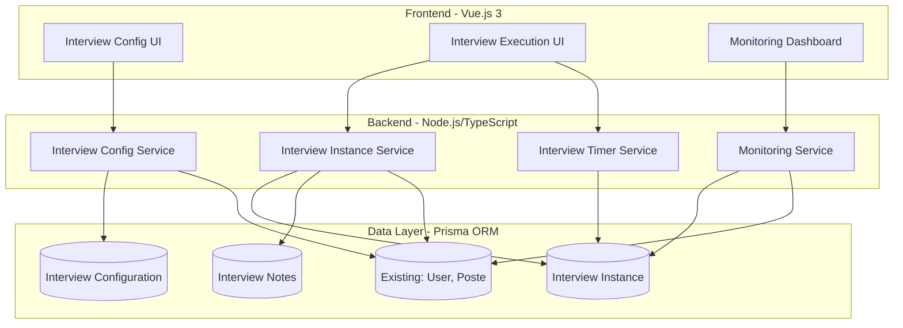
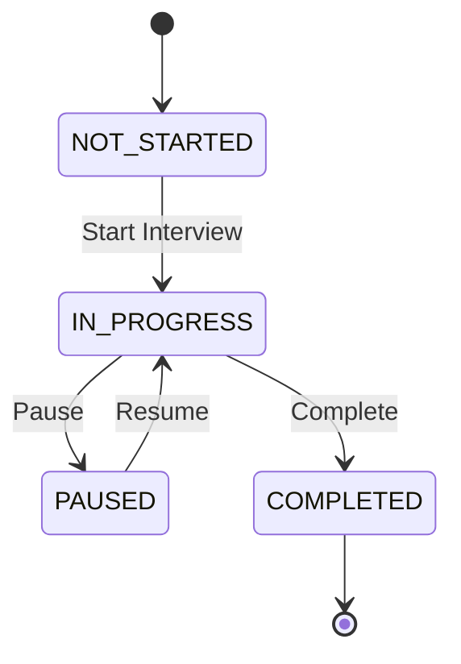

# Design Document - Individual Interviews Management

## Overview

The Individual Interviews Management system provides a comprehensive solution for configuring, executing, and monitoring employee onboarding interviews. The system integrates with the existing Node.js/TypeScript backend using Prisma ORM and Vue.js 3 frontend.

The design follows a layered architecture with clear separation between:
- **Configuration Layer**: Defines interview templates for position types
- **Instance Management Layer**: Creates and manages individual interview occurrences
- **Execution Layer**: Handles interview timing and state transitions
- **Monitoring Layer**: Provides progress tracking and reporting

Key design principles:
- Flexible interviewer specification (by name, function, department, position)
- Automatic interview instance creation based on employee position
- Real-time time tracking with pause/resume capabilities
- Comprehensive progress monitoring across all employees
- Integration with existing User, Poste, and role systems

## Architecture

### System Components



### Data Flow

**Interview Configuration Flow:**
1. Administrator creates interview configuration via UI
2. Configuration service validates and stores template
3. System links configuration to Position_Type

**Interview Instance Creation Flow:**
1. Employee assigned to position or new configuration added
2. Instance service resolves interviewer specifications
3. System creates interview instances for all matching interviewers
4. Instances initialized with not_started status

**Interview Execution Flow:**
1. Administrator selects employee and interview
2. Timer service starts tracking elapsed time
3. State transitions managed (in_progress → paused → completed)
4. Final duration and notes persisted

## Components and Interfaces

### Database Schema Extensions

```typescript
// New Prisma models to add to schema.prisma

model InterviewConfiguration {
  id                String   @id @default(uuid())
  posteId           String
  poste             Poste    @relation(fields: [posteId], references: [id])
  
  // Interviewer specification (one of these will be set)
  interviewerName   String?  // Exact name: "Mr. Dupont, Technical Director"
  interviewerFunction String? // Function: "HR Manager"
  interviewerDepartment String? // Department: "Marketing"
  interviewerPositionType String? // Position type: "senior developer"
  
  standardDurationMinutes Int  // Duration in minutes
  deadlineDays      Int         // Days from employee start date
  
  createdAt         DateTime @default(now())
  updatedAt         DateTime @updatedAt
  createdBy         String
  creator           User     @relation("ConfigCreator", fields: [createdBy], references: [id])
  
  instances         InterviewInstance[]
  
  @@index([posteId])
}

model InterviewInstance {
  id                String   @id @default(uuid())
  configurationId   String
  configuration     InterviewConfiguration @relation(fields: [configurationId], references: [id])
  
  employeeId        String
  employee          User     @relation("InterviewEmployee", fields: [employeeId], references: [id])
  
  interviewerId     String
  interviewer       User     @relation("Interviewer", fields: [interviewerId], references: [id])
  
  status            InterviewStatus @default(NOT_STARTED)
  
  // Timing
  standardDurationMinutes Int
  actualDurationSeconds   Int      @default(0)
  startedAt         DateTime?
  pausedAt          DateTime?
  completedAt       DateTime?
  deadline          DateTime
  
  // Timer state for pause/resume
  accumulatedSeconds Int     @default(0)
  
  createdAt         DateTime @default(now())
  updatedAt         DateTime @updatedAt
  
  notes             InterviewNote[]
  
  @@index([employeeId])
  @@index([interviewerId])
  @@index([status])
  @@index([deadline])
}

enum InterviewStatus {
  NOT_STARTED
  IN_PROGRESS
  PAUSED
  COMPLETED
}

model InterviewNote {
  id                String   @id @default(uuid())
  instanceId        String
  instance          InterviewInstance @relation(fields: [instanceId], references: [id])
  
  content           String   @db.Text
  createdAt         DateTime @default(now())
  updatedAt         DateTime @updatedAt
  authorId          String
  author            User     @relation("NoteAuthor", fields: [authorId], references: [id])
  
  @@index([instanceId])
}
```

### Backend Services

#### InterviewConfigurationService

```typescript
interface InterviewConfigurationService {
  // Create new interview configuration
  createConfiguration(data: CreateConfigurationDTO): Promise<InterviewConfiguration>
  
  // Update existing configuration
  updateConfiguration(id: string, data: UpdateConfigurationDTO): Promise<InterviewConfiguration>
  
  // Delete configuration (soft delete, preserve instances)
  deleteConfiguration(id: string): Promise<void>
  
  // Get configurations for a position type
  getConfigurationsByPoste(posteId: string): Promise<InterviewConfiguration[]>
  
  // Validate configuration data
  validateConfiguration(data: ConfigurationDTO): ValidationResult
}

interface CreateConfigurationDTO {
  posteId: string
  interviewerSpecification: InterviewerSpec
  standardDurationMinutes: number
  deadlineDays: number
}

interface InterviewerSpec {
  type: 'name' | 'function' | 'department' | 'position'
  value: string
}

interface ValidationResult {
  valid: boolean
  errors: string[]
}
```

#### InterviewInstanceService

```typescript
interface InterviewInstanceService {
  // Create instances for an employee based on their position
  createInstancesForEmployee(employeeId: string): Promise<InterviewInstance[]>
  
  // Resolve interviewer specification to actual users
  resolveInterviewers(spec: InterviewerSpec): Promise<User[]>
  
  // Get all instances for an employee
  getInstancesByEmployee(employeeId: string): Promise<InterviewInstance[]>
  
  // Get instance by ID
  getInstance(id: string): Promise<InterviewInstance>
  
  // Update instance status
  updateStatus(id: string, status: InterviewStatus): Promise<InterviewInstance>
  
  // Handle position changes
  handlePositionChange(employeeId: string, newPosteId: string): Promise<void>
}
```

#### InterviewTimerService

```typescript
interface InterviewTimerService {
  // Start interview timer
  startInterview(instanceId: string): Promise<InterviewInstance>
  
  // Pause interview timer
  pauseInterview(instanceId: string): Promise<InterviewInstance>
  
  // Resume interview timer
  resumeInterview(instanceId: string): Promise<InterviewInstance>
  
  // Complete interview and finalize duration
  completeInterview(instanceId: string): Promise<InterviewInstance>
  
  // Get current elapsed time (for active interviews)
  getElapsedTime(instanceId: string): Promise<number>
  
  // Calculate elapsed time from timestamps
  calculateElapsedTime(instance: InterviewInstance): number
}
```

#### MonitoringService

```typescript
interface MonitoringService {
  // Get overview of all employees' interview progress
  getInterviewProgress(filters?: ProgressFilters): Promise<EmployeeProgress[]>
  
  // Get detailed status for a specific employee
  getEmployeeInterviewStatus(employeeId: string): Promise<EmployeeInterviewStatus>
  
  // Get overdue interviews
  getOverdueInterviews(): Promise<InterviewInstance[]>
  
  // Generate analytics report
  generateReport(params: ReportParams): Promise<InterviewReport>
  
  // Export data to CSV
  exportToCSV(filters?: ProgressFilters): Promise<string>
}

interface ProgressFilters {
  posteId?: string
  status?: InterviewStatus
  overdueOnly?: boolean
}

interface EmployeeProgress {
  employeeId: string
  employeeName: string
  posteId: string
  posteName: string
  completedCount: number
  totalCount: number
  overdueCount: number
  nextDeadline?: Date
}

interface EmployeeInterviewStatus {
  employee: User
  instances: InterviewInstance[]
  completionPercentage: number
  overdueInstances: InterviewInstance[]
}

interface InterviewReport {
  averageDurationByType: Map<string, number>
  completionRateByPoste: Map<string, number>
  overdueCount: number
  consistentlyOverdueTypes: string[]
}
```

#### InterviewNoteService

```typescript
interface InterviewNoteService {
  // Add note to interview
  addNote(instanceId: string, content: string, authorId: string): Promise<InterviewNote>
  
  // Update existing note
  updateNote(noteId: string, content: string): Promise<InterviewNote>
  
  // Get all notes for an interview
  getNotesByInstance(instanceId: string): Promise<InterviewNote[]>
  
  // Delete note
  deleteNote(noteId: string): Promise<void>
}
```

### Frontend Components

#### Interview Configuration UI

```typescript
// AdminInterviewConfigPage.vue
interface InterviewConfigComponent {
  // Display list of configurations for selected position
  configurations: InterviewConfiguration[]
  selectedPoste: Poste | null
  
  // Methods
  loadConfigurations(posteId: string): void
  createConfiguration(data: CreateConfigurationDTO): void
  editConfiguration(id: string, data: UpdateConfigurationDTO): void
  deleteConfiguration(id: string): void
}

// InterviewConfigForm.vue
interface ConfigFormComponent {
  // Form data
  form: {
    posteId: string
    interviewerType: 'name' | 'function' | 'department' | 'position'
    interviewerValue: string
    standardDurationMinutes: number
    deadlineDays: number
  }
  
  // Validation
  validateForm(): boolean
  submitForm(): void
}
```

#### Interview Execution UI

```typescript
// InterviewExecutionPage.vue
interface InterviewExecutionComponent {
  // Current interview state
  selectedEmployee: User | null
  currentInterview: InterviewInstance | null
  elapsedTime: number
  isRunning: boolean
  
  // Methods
  selectEmployee(employeeId: string): void
  loadInterviews(employeeId: string): void
  startInterview(instanceId: string): void
  pauseInterview(): void
  resumeInterview(): void
  completeInterview(): void
  
  // Timer display
  formatTime(seconds: number): string
}

// InterviewTimer.vue
interface TimerComponent {
  elapsedSeconds: number
  standardMinutes: number
  isOvertime: boolean
  
  // Display formatted time (MM:SS)
  displayTime: string
  
  // Visual indicator when over standard duration
  overtimeIndicator: boolean
}

// InterviewNotes.vue
interface NotesComponent {
  notes: InterviewNote[]
  newNoteContent: string
  
  addNote(): void
  editNote(noteId: string, content: string): void
  deleteNote(noteId: string): void
}
```

#### Monitoring Dashboard

```typescript
// InterviewMonitoringDashboard.vue
interface MonitoringDashboardComponent {
  // Data
  employeeProgress: EmployeeProgress[]
  filters: ProgressFilters
  
  // Methods
  loadProgress(): void
  applyFilters(filters: ProgressFilters): void
  viewEmployeeDetails(employeeId: string): void
  exportToCSV(): void
  
  // Computed
  overdueEmployees: EmployeeProgress[]
  completionStats: {
    totalEmployees: number
    fullyCompleted: number
    inProgress: number
    notStarted: number
  }
}

// EmployeeInterviewCard.vue
interface EmployeeCardComponent {
  employee: EmployeeProgress
  
  // Display
  completionPercentage: number
  statusBadge: 'success' | 'warning' | 'danger'
  
  // Actions
  viewDetails(): void
}
```

## Data Models

### Core Entities

**InterviewConfiguration**
- Represents a template for interviews required for a position type
- Stores interviewer specification (flexible: name, function, department, or position)
- Defines standard duration and deadline
- Links to Position_Type (Poste model)

**InterviewInstance**
- Represents a specific interview occurrence
- Links to employee, interviewer, and configuration
- Tracks status, timing, and completion
- Stores both standard and actual duration
- Maintains accumulated time for pause/resume functionality

**InterviewNote**
- Stores notes associated with an interview instance
- Links to author (User) and timestamp
- Supports creation, editing, and deletion

### State Machine



### Interviewer Resolution Logic

The system resolves interviewer specifications to actual users:

1. **By Name**: Direct string match on user full name
2. **By Function**: Query users with matching function/role field
3. **By Department**: Query users belonging to specified department
4. **By Position Type**: Query users with matching position type

When multiple users match, the system creates separate interview instances for each.

## Data Models (Continued)

### Timing Calculations

**Elapsed Time Calculation:**
```typescript
function calculateElapsedTime(instance: InterviewInstance): number {
  if (instance.status === 'NOT_STARTED') {
    return 0
  }
  
  if (instance.status === 'COMPLETED') {
    return instance.actualDurationSeconds
  }
  
  // For IN_PROGRESS or PAUSED
  let elapsed = instance.accumulatedSeconds
  
  if (instance.status === 'IN_PROGRESS' && instance.startedAt) {
    const currentSessionSeconds = Math.floor(
      (Date.now() - instance.startedAt.getTime()) / 1000
    )
    elapsed += currentSessionSeconds
  }
  
  return elapsed
}
```

**Deadline Calculation:**
```typescript
function calculateDeadline(
  employeeStartDate: Date,
  deadlineDays: number
): Date {
  const deadline = new Date(employeeStartDate)
  deadline.setDate(deadline.getDate() + deadlineDays)
  return deadline
}
```

### API Endpoints

#### Configuration Endpoints

```typescript
// POST /api/admin/interview-configurations
// Create new interview configuration
POST /api/admin/interview-configurations
Body: CreateConfigurationDTO
Response: InterviewConfiguration

// GET /api/admin/interview-configurations?posteId={id}
// Get configurations for a position
GET /api/admin/interview-configurations
Query: posteId
Response: InterviewConfiguration[]

// PUT /api/admin/interview-configurations/:id
// Update configuration
PUT /api/admin/interview-configurations/:id
Body: UpdateConfigurationDTO
Response: InterviewConfiguration

// DELETE /api/admin/interview-configurations/:id
// Delete configuration
DELETE /api/admin/interview-configurations/:id
Response: { success: boolean }
```

#### Instance Endpoints

```typescript
// GET /api/admin/interview-instances?employeeId={id}
// Get all instances for an employee
GET /api/admin/interview-instances
Query: employeeId
Response: InterviewInstance[]

// POST /api/admin/interview-instances/:id/start
// Start interview
POST /api/admin/interview-instances/:id/start
Response: InterviewInstance

// POST /api/admin/interview-instances/:id/pause
// Pause interview
POST /api/admin/interview-instances/:id/pause
Response: InterviewInstance

// POST /api/admin/interview-instances/:id/resume
// Resume interview
POST /api/admin/interview-instances/:id/resume
Response: InterviewInstance

// POST /api/admin/interview-instances/:id/complete
// Complete interview
POST /api/admin/interview-instances/:id/complete
Response: InterviewInstance
```

#### Monitoring Endpoints

```typescript
// GET /api/admin/interview-monitoring/progress
// Get progress overview
GET /api/admin/interview-monitoring/progress
Query: ProgressFilters (optional)
Response: EmployeeProgress[]

// GET /api/admin/interview-monitoring/employee/:id
// Get detailed status for employee
GET /api/admin/interview-monitoring/employee/:id
Response: EmployeeInterviewStatus

// GET /api/admin/interview-monitoring/overdue
// Get overdue interviews
GET /api/admin/interview-monitoring/overdue
Response: InterviewInstance[]

// GET /api/admin/interview-monitoring/report
// Generate analytics report
GET /api/admin/interview-monitoring/report
Query: ReportParams
Response: InterviewReport

// GET /api/admin/interview-monitoring/export
// Export to CSV
GET /api/admin/interview-monitoring/export
Query: ProgressFilters (optional)
Response: CSV file
```

#### Notes Endpoints

```typescript
// POST /api/admin/interview-instances/:id/notes
// Add note to interview
POST /api/admin/interview-instances/:id/notes
Body: { content: string }
Response: InterviewNote

// PUT /api/admin/interview-notes/:id
// Update note
PUT /api/admin/interview-notes/:id
Body: { content: string }
Response: InterviewNote

// GET /api/admin/interview-instances/:id/notes
// Get all notes for interview
GET /api/admin/interview-instances/:id/notes
Response: InterviewNote[]

// DELETE /api/admin/interview-notes/:id
// Delete note
DELETE /api/admin/interview-notes/:id
Response: { success: boolean }
```

